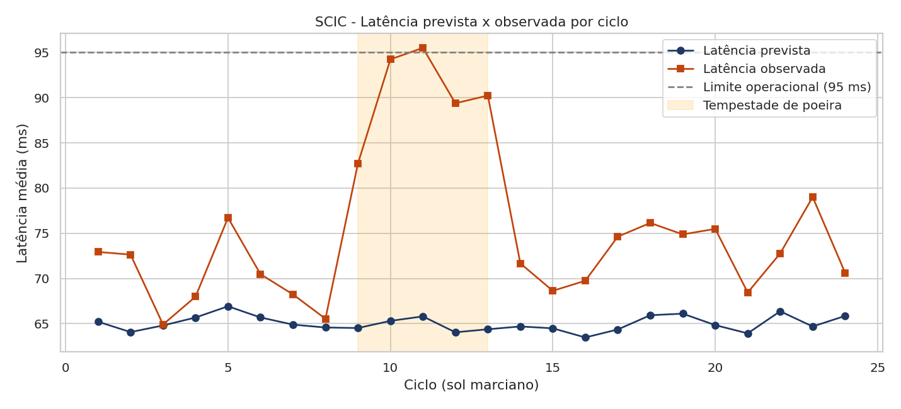
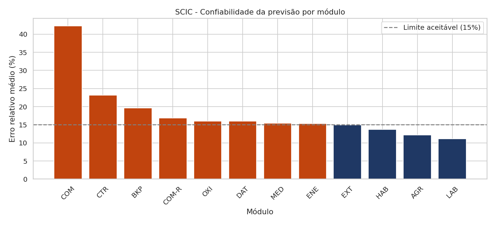
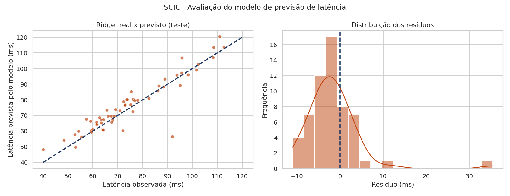
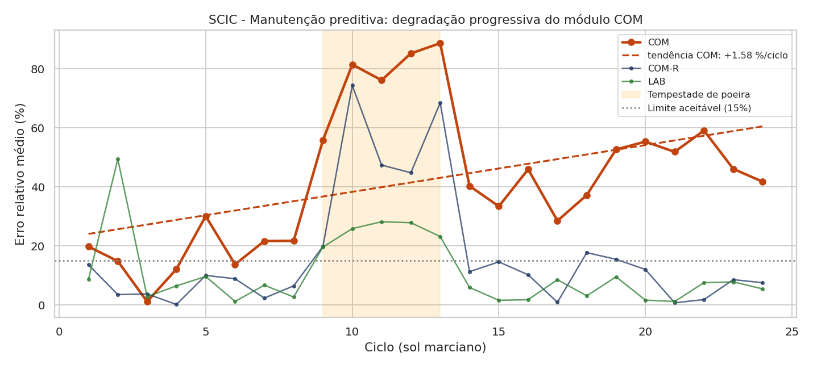
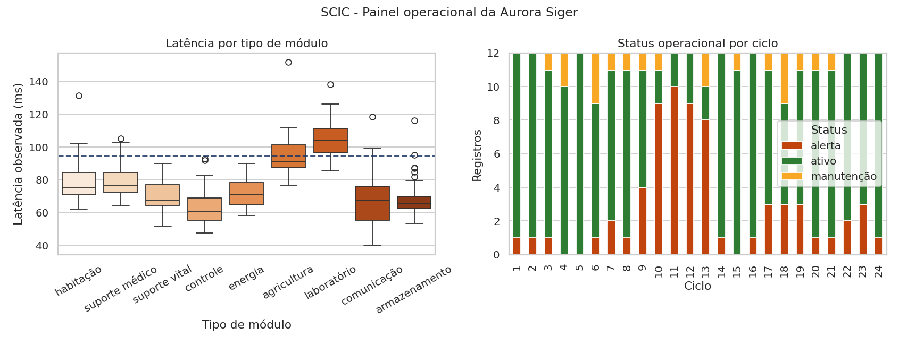

# Relatório Técnico | SCIC
## Sistema de Comunicação Interplanetária da Colônia

**Aurora Siger | Base Harmonia-7, Marte | Setor 07, Comunicação**
**FIAP | Ciência da Computação | Fase 6**
**Grupo: Gabriel, Lucas, Matheus, Miguel e Pedro**

---

## 1. Contexto da solução

### 1.1 Continuidade da missão

| Fase | Sistema | Entrega |
|---|---|---|
| 4 | SIGIC | Gerenciamento da infraestrutura da colônia. |
| 5 | NCAS | Núcleo cognitivo: arquivos texto/JSON, regras booleanas, prompts estruturados. |
| **6** | **SCIC** | **Este sistema.** Análise numérica, modelo preditivo e estruturas de dados. |

A ligação com a Fase 5 não é só temática. O NCAS encerrou com dois registros em aberto no `dados_colonia.json`: o módulo AGR em MANUTENÇÃO e, mais grave, o módulo COM em ALERTA, com a mensagem "perda intermitente de sinal no link de comunicação com a Terra", de 01/09/2026.

O SCIC começa onde aquele alerta parou. A base cobre os ciclos de 03/09 a 26/09/2026, ou seja, do dia seguinte ao último registro do NCAS em diante, e o cadastro de módulos é o mesmo arquivo da Fase 5, acrescido de quatro módulos novos. O resultado principal deste relatório é sobre aquele alerta: ele não foi resolvido, e o módulo COM está se degradando progressivamente (seção 9.1).

### 1.2 O problema operacional

A colônia depende de um enlace principal de comunicação, e a latência observada nem sempre corresponde à prevista pelo modelo de projeto. Quando essa diferença cresce, a equipe perde a capacidade de distinguir três situações: ruído de medição, interferência atmosférica temporária e degradação real de hardware. Tratar as três igual gera manutenção desnecessária em uns casos e falha não antecipada em outros, que foi o que aconteceu com o COM.

O SCIC responde a quatro perguntas: quão confiável é a previsão de cada módulo; qual alerta atender agora; como localizar um registro entre centenas; e quanto da comunicação está dentro do limite operacional.

---

## 2. Descrição dos dados

`dados_aurora_siger.csv` é uma base simulada, com 288 registros (12 módulos × 24 ciclos) em 20 colunas. Ela é construída pela função `gerar_base_simulada()`, no BLOCO 0 do próprio `codigo_fonte.py`. A escolha é deliberada: o gerador viaja com o sistema, pode ser lido pelo avaliador e reexecutado pela opção 11 do menu. A semente é fixa (`42`), então a base recriada é idêntica à entregue, e se o CSV for apagado o sistema o regenera sozinho.

### 2.1 Cadastro de módulos

Os oito primeiros têm código, nome, prioridade e consumo idênticos ao `dados_colonia.json` da Fase 5:

| Código | Nome | Tipo | Prior. | kW | Origem |
|---|---|---|---|---|---|
| HAB | Habitação | habitação | 4 | 18,5 | Fase 5 |
| MED | Suporte Médico | suporte médico | 5 | 12,3 | Fase 5 |
| OXI | Produção de Oxigênio | suporte vital | 5 | 24,7 | Fase 5 |
| CTR | Centro de Controle | controle | 4 | 15,1 | Fase 5 |
| ENE | Armazenamento de Energia | energia | 5 | 5,4 | Fase 5 |
| AGR | Agricultura | agricultura | 2 | 21,0 | Fase 5 |
| LAB | Laboratório Científico | laboratório | 2 | 13,8 | Fase 5 |
| COM | Comunicação | comunicação | 3 | 9,6 | Fase 5 |
| COM-R | Enlace Redundante | comunicação | 3 | 8,9 | **Fase 6** |
| DAT | Armazenamento de Dados | armazenamento | 4 | 11,2 | **Fase 6** |
| BKP | Backup Redundante | armazenamento | 3 | 7,8 | **Fase 6** |
| EXT | Antena Externa Remota | comunicação | 3 | 6,5 | **Fase 6** |

Os quatro últimos são a expansão desta fase, já que o NCAS não acompanhava enlace redundante, armazenamento de dados nem antena externa.

### 2.2 Campos e processo gerador

Além da identificação (`id_registro`, `ciclo`, `data`, `codigo_modulo`, `nome_modulo`, `tipo_modulo`, `codigo_sensor`), a base traz `latencia_prevista_ms` e `latencia_observada_ms`, as grandezas elétricas (`tensao_v`, `corrente_a`, `potencia_w`, `consumo_modulo_kw`), `distancia_antena_m`, `carga_processamento_pct`, `indice_interferencia`, `status_operacional`, `nivel_prioridade`, `mensagem_alerta` e `origem_cadastro`.

A latência prevista segue uma fórmula de projeto simplificada:

```
latencia_prevista = base_do_tipo + 0,045 × distância + 0,22 × carga − 0,135 × potência
```

A observada acrescenta o que o modelo de projeto não captura: interferência atmosférica (os ciclos 9 a 13 simulam tempestade de poeira, com índice de 0,55 a 0,95), ruído de medição (σ ≈ 3,2 ms), falhas raras de hardware em 5% dos registros e a degradação progressiva do COM, de 0,95 ms por ciclo, representando a antena sem reparo desde a Fase 5.

Sobre a acentuação: campos de exibição são gravados acentuados (`nome_modulo` = "Comunicação"), enquanto campos usados como chave ficam sem acento (`tipo_modulo` = `comunicacao`, `status_operacional` = `manutencao`), porque são usados para filtrar e agrupar. A acentuação é aplicada na tela pelo dicionário `ROTULOS`. É a mesma separação que o `dados_colonia.json` já fazia entre `COM` e "Comunicação".

O carregamento (`carregar_dados()`) remove duplicatas, descarta registros sem latência, padroniza texto e cria as colunas derivadas de erro.

---

## 3. Indicadores de comunicação calculados

A equipe de missão definiu dois limiares: latência de 95 ms, acima da qual teleoperação e suporte médico remoto ficam comprometidos, e erro relativo de 15%, que é a margem de projeto.

| Indicador | Valor |
|---|---|
| Latência média observada | **75,57 ms** |
| Latência máxima observada | 151,86 ms |
| Disponibilidade do enlace (< 95 ms) | **85,42%** |
| Registros em alerta | 66 (22,9%) |
| Registros em manutenção | 20 (6,9%) |
| Potência média de transmissão | 49,53 W por módulo |

| Tipo | Prevista (ms) | Observada (ms) | Erro relativo (%) |
|---|---|---|---|
| laboratório | 95,76 | 105,43 | 11,07 |
| agricultura | 85,58 | 95,62 | 12,21 |
| suporte médico | 69,82 | 80,03 | 15,42 |
| habitação | 70,58 | 79,75 | 13,69 |
| armazenamento | 58,46 | 68,30 | 17,81 |
| **comunicação** | 55,25 | 67,72 | **24,68** |
| controle | 52,15 | 64,06 | 23,19 |

A tabela já mostra por que um indicador isolado engana. Os laboratórios têm a maior latência absoluta (105,43 ms) e o menor erro relativo (11,07%): são lentos de forma previsível, o que é operacionalmente aceitável. Os módulos de comunicação são rápidos (67,72 ms) e os mais imprevisíveis (24,68%), e é a imprevisibilidade que compromete decisão crítica.



*Figura 1. Latência prevista x observada por ciclo. A faixa alaranjada marca a tempestade de poeira (ciclos 9 a 13).*

---

## 4. Análise dos erros numéricos

### 4.1 Erro absoluto e erro relativo

```
erro_absoluto = |latência_observada − latência_prevista|
erro_relativo = erro_absoluto / latência_prevista
```

| Métrica | Valor |
|---|---|
| Erro absoluto médio / máximo | 11,01 ms / 60,54 ms |
| Erro relativo médio / máximo | 18,05% / 108,38% |
| Previsões com erro aceitável (≤ 15%) | 63,89% |

O erro absoluto diz de quantos milissegundos o modelo errou, e é o que importa para o operador, porque o limite de 95 ms é absoluto. O erro relativo diz se o erro é grande para a escala daquele módulo, e é o que permite comparar módulos diferentes. O caso mais claro está nestas duas linhas:

| Módulo | Latência prevista | Erro absoluto | Erro relativo |
|---|---|---|---|
| COM | 46,89 ms | 19,92 ms | **42,26%** |
| AGR | 85,58 ms | 10,61 ms | **12,21%** |

COM erra quase o dobro de AGR em milissegundos, mas opera numa escala muito menor. Proporcionalmente, erra 3,5 vezes mais. Olhando só o erro absoluto, a diferença pareceria de duas vezes.

A classificação adotada é: até 15%, aceitável; acima de 15%, preocupante, com revisão de enlace ou antena; e latência acima de 95 ms, crítico, acionando a fila de prioridade.



*Figura 2. Confiabilidade da previsão por módulo. Em laranja, os que passam do limite de 15%.*

### 4.2 Ponto flutuante e precisão numérica

As latências são `float64`, o que torna igualdade exata insegura. O sistema demonstra isso na opção 3:

```
0.1 + 0.2            = 0.30000000000000004
(0.1 + 0.2) == 0.3   -> False
math.isclose(...)    -> True
```

Na prática, o SCIC soma os 288 erros absolutos de duas formas, vetorizada (NumPy) e acumulada em laço, e a diferença fica na ordem de 1e-12 ms, cerca de um trilhão de vezes menor que o ruído do sensor (≈ 3 ms). A conclusão operacional é que diferenças nessa ordem são ruído numérico, não anomalia de comunicação. Por isso o sistema compara latências com tolerância (`math.isclose`), nunca com `==`, e arredonda só na exibição. O mesmo vale na conferência de `P = V × I`: a maior diferença entre a potência gravada no CSV e a recalculada foi de 0,025 W, puro arredondamento de gravação.

### 4.3 Simulação numérica pelo método de Euler

Para estimar em quantos ciclos um enlace degradado volta ao normal, o sistema integra um modelo de recuperação:

```
dL/dt = −k × (L − L_equilíbrio),    k = 0,35 por ciclo,    h = 0,5 ciclo
```

Ele parte da última latência observada e converge para a média prevista, dando uma estimativa de janela de recuperação sem modelos físicos avançados. A limitação é conhecida: Euler é de primeira ordem e o erro de truncamento cresce com `h`, então com `h = 0,5` o resultado serve para a ordem de grandeza, não para previsão fina.

---

## 5. Modelo simples de previsão e avaliação de performance

O problema é de regressão: prever `latencia_observada_ms` a partir de grandezas mensuráveis antes da transmissão, que são distância, carga, potência, tensão, interferência, prioridade e o tipo do módulo em colunas binárias (`pd.get_dummies`), somando 15 atributos. A divisão é 60/20/20 (172 treino, 58 validação, 58 teste), com `random_state=42`, e o conjunto de teste é usado uma única vez.

**Validação:**

| Modelo | MAE | MSE | RMSE | R² |
|---|---|---|---|---|
| Baseline (média do treino) | 15,735 | 389,038 | 19,724 | −0,0045 |
| Regressão Linear | 6,543 | 114,278 | 10,690 | 0,7049 |
| **Ridge (α = 1,0)** | **6,504** | **113,035** | **10,632** | **0,7081** |

O Grid Search testou 6 valores de α com validação cruzada de 5 dobras, otimizando o MAE. Os critérios AIC e BIC no treino (737,74 e 788,10 para a Linear contra 739,93 e 790,29 do Ridge) favorecem levemente a Regressão Linear, o que é coerente: eles medem ajuste no treino penalizado por número de parâmetros, e a regularização do Ridge troca ajuste por generalização. Como os dois usam os mesmos 15 atributos, a penalização é idêntica. O Ridge foi escolhido pelo MAE de validação, que mede desempenho em dados não vistos.

**Teste final:**

| Modelo | MAE | MSE | RMSE | R² |
|---|---|---|---|---|
| **Ridge (teste)** | **4,439** | **44,677** | **6,684** | **0,8419** |
| Baseline (teste) | 14,005 | 285,860 | 16,907 | −0,0113 |

### 5.1 Interpretação das métricas

O MAE de 4,44 ms é o erro típico, equivalente a 6,0% da latência média do teste, e é o número a comunicar ao operador. O MSE de 44,68 ms² penaliza erros grandes, mas está em unidade ao quadrado e não é comparável com a latência. O RMSE de 6,68 ms volta à unidade original e continua sensível aos piores casos. O R² de 0,8419 indica que o modelo explica 84,2% da variação, enquanto o baseline tem R² negativo, o que confirma que prever a média é pior do que não prever.

A relação RMSE/MAE de 1,51 é o diagnóstico mais informativo. Se os erros fossem parecidos, as duas métricas seriam próximas; estarem 51% distantes significa que o erro se concentra em poucos registros muito ruins, que são os ciclos de tempestade, as falhas raras e, principalmente, o módulo COM.

Aqui está o ponto central: a degradação do COM é invisível para o modelo. Nenhum dos 15 atributos informa há quantos ciclos a antena está sem manutenção, então ela não é prevista e aparece apenas como erro. Um R² de 0,84 parece bom, mas os 16% não explicados não estão distribuídos: estão no módulo que a colônia mais precisa monitorar. É por isso que um R² alto não significa modelo perfeito, e por isso o SCIC não para no modelo.

O ganho sobre o baseline é de 68,3% no MAE. Nos coeficientes, o índice de interferência domina, o que significa que a maior fonte identificável de latência é ambiental, não do equipamento. Contra tempestade não há manutenção que resolva: o que resolve é redundância e reprogramação de tráfego.



*Figura 3. Real x previsto no conjunto de teste e distribuição dos resíduos.*

---

## 6. Priorização de alertas com heap

São tratados como alerta os registros com status `alerta` ou `manutencao`, ou com latência acima do limite, o que dá 109 ocorrências entre os 288. Cada uma é um dicionário com ciclo, módulo, sensor, latência, erro relativo, status e mensagem.

**Critério de prioridade:**

```
pontuação = 2,0 × criticidade do módulo (1 a 5)
          + 0,25 × erro relativo (%)
          + bônus de status (alerta = 10 | manutenção = 3)
          + 0,4 × ciclos desde o registro (limitado a 6)
          + 5,0 se a latência passou do limite operacional
```

Cada fator responde a uma preocupação. A criticidade põe suporte médico e oxigênio à frente de laboratório. O erro relativo mede o quanto o módulo fugiu do esperado. O bônus de status separa falha de manutenção programada. E o envelhecimento impede que um alerta antigo fique esquecido, com teto de 6 pontos para nunca superar a criticidade real.

Sobre a estrutura: o heap foi implementado manualmente (`FilaDePrioridadeAlertas`), sem `heapq`, para deixar explícitas as duas operações estudadas. O `_heapify_up` sobe o novo alerta trocando com o pai enquanto tiver pontuação maior, e o `_heapify_down` faz o último elemento assumir a raiz e descer trocando com o maior filho. Ele é representado como lista, com filhos em `2i+1` e `2i+2` e pai em `(i−1)//2`. Com 109 alertas, a árvore tem cerca de 7 níveis.

O alerta mais urgente foi o BKP (Backup Redundante), no ciclo 18, com pontuação 50,49: 116,40 ms, erro de 108,4% e a mensagem "Queda de tensão no transmissor". Entre os dez primeiros, o COM aparece quatro vezes (ciclos 10 a 13), mais que qualquer outro módulo. O heap não foi feito para dar esse sinal, mas a leitura da fila revela: um módulo que ocupa quatro das dez primeiras posições não tem problema pontual, tem problema permanente.

Vale registrar uma limitação honesta do critério. O COM carrega prioridade cadastral 3, herdada da Fase 5, enquanto MED, OXI e ENE têm 5. Como a criticidade pesa 2,0 por nível, ele começa de 2 a 4 pontos atrás e não chega ao topo, apesar de ser o módulo mais degradado. O SCIC não corrige esse peso sozinho, já que o cadastro é decisão da equipe, mas registra a recomendação: num sistema cuja operação depende do enlace, a prioridade do COM está subestimada e deveria ir para 5.

**Vantagem sobre uma lista simples:**

| Operação | Lista simples | Heap |
|---|---|---|
| Consultar o mais urgente | O(n), varre os 109 | **O(1)**, está na raiz |
| Inserir | O(n) mantendo ordenada | **O(log n)**, ≈ 7 comparações |
| Remover o mais urgente | O(n) | **O(log n)** |

Os alertas chegam a cada ciclo, e reordenar a lista inteira a cada ocorrência seria desperdício num sistema que precisa responder rápido.

---

## 7. Busca de registros com trie

A trie indexa 88 chaves de cinco famílias: códigos de módulo (`com`, `com-r`, `med`), nomes completos (`comunicação`, `laboratório científico`), códigos de sensor em hexadecimal (`0x3c01`), tipos, palavras-chave de alertas e comandos do terminal, e os operadores autorizados `CMDT_SILVA`, `ENG_ROCHA` e `MED_ALVES`, que são o mesmo cadastro do NCAS. Cada nó guarda os filhos, a marca de fim de palavra, o texto original e os registros associados.

| Prefixo | Retorno |
|---|---|
| `com` | 7 chaves: `com`, `com-r`, `comando_controle_enlace`, `comando_diagnostico`, `comando_reiniciar_enlace`, `comando_status`, `comunicação` |
| `0x3` | 4 chaves: `0x3c01` (COM), `0x3c02` (COM-R), `0x3d11` (CTR), `0x3e40` (EXT) |
| `manut` | `manutenção` (palavra-chave) e `manutencao_preventiva` (comando) |

A trie é adequada porque a busca desce um nó por caractere do prefixo: o custo é O(p), dependente do que foi digitado e não da quantidade de registros. Uma lista simples precisaria rodar `startswith()` nas 88 chaves a cada tecla. Na prática, isso dá busca incremental instantânea no terminal: o operador digita `0x3` e vê os sensores da família de comunicação sem lembrar o código inteiro. Como o primeiro dígito hexadecimal codifica a família do módulo, o esquema de endereçamento vira consulta por categoria sem custo adicional.

A árvore é percorrida pela forma sem acento, usando `unicodedata.normalize('NFD', …)` e descartando as marcas, e guarda o texto original no nó final para exibição. Assim `latencia` e `latência` chegam ao mesmo nó, e `producao` encontra "Produção de Oxigênio". Isso é necessário porque os nomes vindos da Fase 5 são acentuados e o operador nem sempre digita acento.

---

## 8. Dispositivos, bases numéricas e eletricidade aplicada

Na entrada estão os sensores de latência do transceptor de cada módulo, os medidores de tensão e corrente do barramento de 28 V, o sensor de interferência atmosférica e o teclado do terminal do operador.

Na saída estão o terminal de texto da sala de controle (o menu), os gráficos em `graficos/`, o `resumo_analise.json` exportado ao fim da análise e este relatório.

As interfaces, em nível conceitual, são a rede interna Ethernet/Wi-Fi ligando os módulos à antena central, USB/serial na coleta local dos sensores, Bluetooth de curto alcance nos medidores portáteis de inspeção e o enlace de rádio de alta potência no salto Marte/Terra.

### 8.1 Bases numéricas

Cada sensor tem um código de 16 bits em hexadecimal, cujo primeiro dígito identifica a família: 1 habitação, 2 agricultura, 3 comunicação e controle, 4 laboratório, 5 suporte médico, 6 armazenamento, 7 suporte vital e energia.

| Módulo | Hexadecimal | Decimal | Binário |
|---|---|---|---|
| HAB | 0x1A3F | 6719 | 0001 1010 0011 1111 |
| COM | 0x3C01 | 15361 | 0011 1100 0000 0001 |
| MED | 0x5F09 | 24329 | 0101 1111 0000 1001 |
| OXI | 0x7B12 | 31506 | 0111 1011 0001 0010 |

Conversão executada pelo sistema para `0x1A3F`:

```
hexadecimal → decimal : 0x1A3F = 6719
decimal → binário     : 6719   = 1101000111111
binário → hexadecimal : 1101000111111 = 0x1a3f
```

Com 16 bits cabem 65.536 sensores, folga suficiente para a expansão da colônia. A escolha do hexadecimal não é estética: dois dígitos equivalem a um byte, o que torna direta a leitura do endereço no barramento. E, como visto na seção 7, o prefixo do código já funciona como consulta por categoria.

### 8.2 Eletricidade aplicada à comunicação

```
Lei de Ohm:  V = R × I   →   R = V / I
Potência:    P = V × I
```

| Módulo | V (V) | I (A) | P = V×I (W) | R = V/I (Ω) |
|---|---|---|---|---|
| AGR | 27,60 | 1,927 | 53,19 | 14,32 |
| COM | 27,55 | 1,612 | 44,42 | 17,08 |
| COM-R | 27,42 | 1,681 | 46,08 | 16,31 |
| DAT | 27,30 | 1,681 | 45,89 | 16,24 |

Somando os transmissores, a colônia gasta em média 594,36 W por ciclo, cerca de 14,26 kWh em 24 h.

Isso conecta comunicação e energia. A potência entra no modelo de latência com coeficiente negativo: mais potência significa menos retransmissão. Mas a potência vem da microrrede solar, que é finita, e o cadastro da Fase 5 mostra a escala do orçamento, já que só o OXI consome 24,7 kW. Existe então um ponto de equilíbrio real: potência excessiva desperdiça energia que faltará ao suporte de vida, e potência insuficiente gera retransmissões que consomem mais no total. Cada retransmissão evitada é energia solar poupada.

---

## 9. Gerenciamento inteligente da comunicação

Sobre sensores e coleta: os 12 módulos publicam a cada ciclo latência, tensão, corrente, carga e interferência. Esse fluxo alimenta as 20 colunas do CSV e cumpre, no protótipo, o papel da telemetria de uma rede IoT.

Sobre monitoramento e detecção de anomalias: o erro relativo funciona como detector, e acima de 15% o módulo deixou de seguir o modelo. O padrão encontrado é o que o torna útil. Nos ciclos 10, 11 e 12, entre 33% e 50% dos módulos passaram do limite ao mesmo tempo, e anomalia simultânea em módulos distantes é assinatura de causa externa, não de falha de equipamento. O sistema separa "a colônia está sob tempestade" de "esta antena está quebrando", diagnósticos que pedem respostas opostas.

### 9.1 Manutenção preditiva, o achado principal

Para cada módulo, o sistema ajusta uma reta ao erro relativo em função do ciclo (`np.polyfit`, grau 1). O coeficiente angular diz quantos pontos percentuais de erro o módulo ganha por ciclo:

| Módulo | Tendência (%/ciclo) | Diagnóstico |
|---|---|---|
| **COM** | **+1,58** | **DEGRADAÇÃO PROGRESSIVA, agendar manutenção** |
| CTR | +0,79 | tendência de piora, monitorar |
| AGR | +0,46 | tendência de piora, monitorar |
| EXT | +0,01 | estável |

O erro do COM sai de 19,8% no ciclo 1 para 41,7% no ciclo 24, e continua alto depois do fim da tempestade, no ciclo 13. Essa é a assinatura que distingue os dois fenômenos: interferência ambiental sobe e desce junto com o índice de poeira, em todos os módulos ao mesmo tempo, enquanto degradação de hardware cresce de forma sustentada, em um módulo só, e não volta.

O alerta do NCAS não foi um evento isolado. A antena não foi reparada, e 24 ciclos depois o SCIC mede a consequência. É esse o gatilho de manutenção preditiva: agir antes da falha, por tendência e não por limiar. Vale notar que o modelo de regressão sozinho não acharia isso, porque a degradação é parte dos 16% que o R² deixa de fora. Foram precisas duas ferramentas, o modelo para o comportamento normal e a tendência para o desvio sistemático.



*Figura 4. COM-R e LAB voltam ao normal depois da tempestade; o COM não volta e segue a reta de +1,58 %/ciclo.*

Sobre automação de decisão: o heap transforma 109 ocorrências dispersas numa ordem de atendimento objetiva e auditável. A equipe não precisa ler todos os alertas, porque o topo da fila responde "o que atender agora", e o critério está impresso na tela, não é caixa-preta.

Sobre redundância e armazenamento: COM/COM-R e DAT/BKP formam pares redundantes, ambos novidade desta fase. A análise mostra que a redundância é necessária, porque COM-R tem erro de 16,8% contra 42,3% do principal, ou seja, deveria assumir o tráfego crítico até o reparo do COM.

Sobre redes inteligentes e microrredes: os 594 W médios saem do mesmo orçamento solar das estufas e do suporte de vida. Priorizar transmissão é decisão energética, e uma rede inteligente aqui não é a que transmite mais, é a que decide o que vale transmitir em cada ciclo.



*Figura 5. Latência por tipo de módulo e status operacional ao longo dos ciclos.*

---

## 10. Reflexão social, cultural e sustentável

**Uso eficiente da comunicação e sustentabilidade.** Numa colônia marciana não há rede elétrica externa, e toda transmissão consome energia solar armazenada. O SCIC reduz desperdício ao prever latência, o que evita retransmissões; ao priorizar alertas, o que evita deslocamento por falso positivo; e ao distinguir interferência ambiental de degradação de hardware, o que evita trocar equipamento cujo transporte da Terra custa recursos irreproduzíveis. O caso do COM mostra o outro lado da moeda: adiar manutenção também é desperdício, porque um enlace degradado retransmite e consome mais a cada ciclo.

**Saberes afro-brasileiros e cuidado coletivo.** A tradição de mutirão e ajuda mútua das comunidades quilombolas oferece um princípio que a colônia precisa adotar por necessidade: recurso escasso é gerido coletivamente, e quem define a prioridade presta contas ao grupo. O SCIC aplica isso ao imprimir a fórmula de prioridade antes de qualquer resultado, de modo que a ordem de atendimento é um critério que a tripulação pode ler, questionar e mudar. A recomendação de rever a prioridade do COM nasceu desse escrutínio, não de um ajuste automático.

**Conhecimentos tradicionais e respeito aos recursos.** Culturas indígenas brasileiras cultivam há séculos uma lógica que a colônia replica por necessidade: tomar só o necessário, observar os ciclos do ambiente antes de agir e tratar o recurso como emprestado. O SCIC incorpora isso ao organizar os dados por ciclo e ao recomendar redução de tráfego não essencial durante a tempestade, em vez de aumentar potência para "vencer" a interferência. É adaptação ao ambiente em vez de imposição, e também a decisão energeticamente correta.

**Diversidade e sistemas não excludentes.** Um sistema de priorização define quem é atendido primeiro. O critério do SCIC é explícito e baseado em risco operacional, nunca em características das pessoas que ocupam cada módulo, e a regra de envelhecimento existe para impedir que um módulo "menos importante" fique permanentemente no fim da fila. A lição concreta desta fase é que um peso mal calibrado exclui silenciosamente: o COM ficou fora do topo por 24 ciclos porque sua prioridade cadastral era 3, não porque estivesse bem. Critérios automatizados herdam decisões antigas sem questioná-las, e revisá-los é responsabilidade da equipe.

**Transparência e responsabilidade humana.** Todos os critérios são auditáveis. A fórmula do heap é impressa antes do resultado, os coeficientes do modelo são exibidos, as métricas vêm acompanhadas de interpretação e o gerador da base acompanha o código. O SCIC é um sistema de apoio: ordena alertas, estima latências e aponta degradação, mas nunca desliga um enlace nem agenda manutenção sozinho. As métricas justificam essa fronteira, porque com RMSE/MAE de 1,51 e uma degradação real que o modelo não previu, sabe-se que a previsão falha justamente nos eventos críticos. Automatizar a decisão final seria delegar autoridade ao componente menos confiável no pior momento.

---

## 11. Limitações e possíveis melhorias

**Limitações.** A base é simulada por um processo conhecido, o que favorece o modelo, e com telemetria real o R² seria menor. Nenhum atributo informa tempo desde a última manutenção, então o modelo é cego à degradação e foi preciso detectá-la por tendência, fora da regressão. O modelo é linear e não captura interações, como interferência alta combinada com potência baixa. Euler é de primeira ordem, adequado para ordem de grandeza e não para precisão. Os pesos do heap foram definidos manualmente e as prioridades cadastrais vieram da Fase 5 sem revisão, e o caso do COM mostra o custo disso. Cada registro é tratado de forma independente, sem série temporal. Por fim, a trie ignora acentos, mas não tolera erro de digitação.

**Melhorias.** Incluir atributos defasados, como a latência dos ciclos anteriores e os ciclos desde a última manutenção, para que o próprio modelo capture desgaste. Testar modelos não lineares com Random Search, comparando por AIC e BIC. Recalibrar as prioridades cadastrais pelo impacto operacional medido, a começar pelo COM. Substituir Euler por Runge-Kutta de 4ª ordem se a precisão da janela de recuperação se tornar crítica. Adicionar detecção de deriva, comparando o erro do modelo entre ciclos para saber quando retreinar. Estender a trie com busca aproximada. E realimentar o NCAS da Fase 5, exportando os alertas priorizados de volta ao `dados_colonia.json`.

---

## 12. Conclusão

O SCIC demonstra, num protótipo executável, o ciclo completo de apoio à decisão: organização dos dados com Pandas, indicadores operacionais, análise de erro absoluto e relativo (incluindo ponto flutuante), simulação com Euler, modelo de regressão avaliado por MAE, MSE, RMSE e R² com divisão treino/validação/teste e Grid Search, priorização com heap implementado manualmente e busca por prefixo com trie.

O resultado técnico é o modelo com MAE de 4,44 ms e R² de 0,8419, 68,3% melhor que o baseline. Mas o resultado que justifica o sistema é outro: o SCIC identificou que o módulo COM se degrada a 1,58 pontos percentuais por ciclo e fechou o alerta que a Fase 5 deixou em aberto, algo que nem o modelo, nem o limiar de erro, nem a fila de prioridade conseguiriam sozinhos.

Esse achado resume a tese do trabalho: nenhuma métrica isolada avalia um sistema. Um R² de 0,84 parecia suficiente até se notar que o erro restante estava concentrado num único módulo crítico. Foi preciso cruzar modelo, tendência, heap e leitura humana da fila, e é por isso que o SCIC permanece como ferramenta de apoio, com a decisão final sob responsabilidade da equipe da colônia.

---

*Aurora Siger. Exploramos dados. Construímos soluções. Geramos impacto para o amanhã em Marte.*
